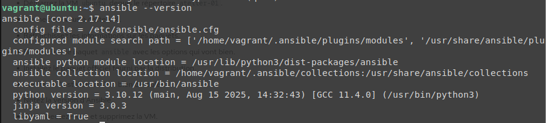
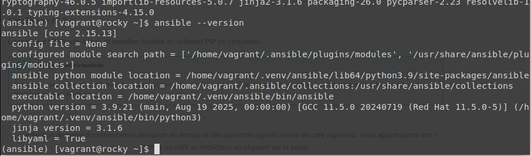
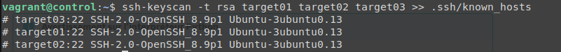
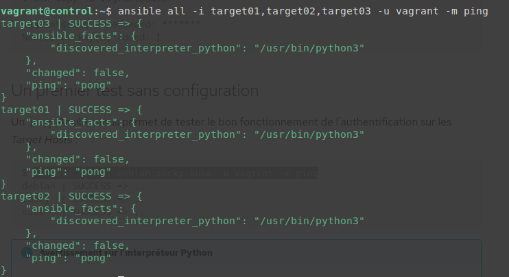
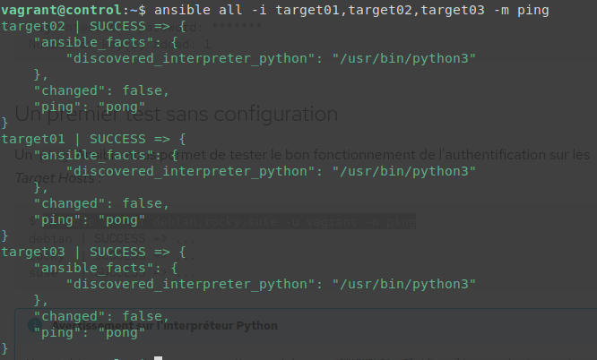

# ansible-kovacs


# Installer Ansible


# TEST-01 :
```
cd formation-ansible/test-01/
vagrant up
```


### Les pings : 


------------------------------------------------------
# TEST-02 :
```
cd formation-ansible/test-02/
vagrant up
```


-------------------------------------------------------

# ATELIER-01 : 

## Challenge-01 :

* Démarrez la VM ubuntu depuis le répertoire atelier-01.
```
vagrant up ubuntu
```
* Connectez-vous à cette VM.
```
vagrant ssh ubuntu
```
* Rafraîchissez les informations sur les paquets.
```
sudo apt update
```
* Recherchez le paquet ansible avec les options qui vont bien.
```
apt-cache search --names-only ansible
```
* Installez le paquet officiel fourni par la distribution.
```
sudo apt install -y ansible
```
* Vérifiez si l'installation s'est bien déroulée.
```
ansible --version
```


`version : 2.10.8`

Déconnectez-vous et supprimez la VM.
```
exit

vagrant destroy -f ubuntu
```

## Challenge-02 :

#### Répétez le challenge précédent en configurant un dépôt PPA (Personal Package Archive) pour Ansible :
```
vagrant up ubuntu
vagrant ssh ubuntu
sudo apt update
sudo apt-add-repository ppa:ansible/ansible
apt-cache search --names-only ansible
sudo apt install -y ansible
ansible --version
```

`version : 2.17.14`

### On remarque que la version est plus récente que la version officielle du challenge précédent.


## Challenge-03 :

* Démarrer la VM rocky :
```
vagrant up rocky
```
Se Connecter à cette VM :
```
vagrant ssh rocky
```
* L'ajout du dépôt tiers EPEL 
```
sudo dnf install -y epel-release
```
* Activation du dépôt officiel Code Ready Builder :
```
sudo crb enable
```
* Installer PIP :
```
sudo dnf install -y python3-pip
```
* Initialisez l'environnement Virtualenv :
```
python3 -m venv ~/.venv/ansible
```
* Lancement de l'environnement Virtuel :
```
source ~/.venv/ansible/bin/activate
```
* Mettez à jour PIP :
```
(ansible) $ pip install --upgrade pip
```
* Installez Ansible :
```
(ansible) $ pip install ansible
```
* Vérifiez la version :
```
(ansible) $ ansible --version
```
* Quittez l'environnement Virtualenv :
```
(ansible) $ deactivate
```
* Quittez la VM :
```
exit 
```
* Détruisez la VM : 
```
vagrant destroy -f rocky
```


`Version : 2.15.13`

-------------------------------------------------------

# ATELIER-03 : 
# Authentification sur les Target Hosts


* Démarrer les VM : 
```
vagrant up
```

* Connectez-vous au Control Host :
```
vagrant ssh control
```

* Vérification de ansible : 
```
type ansible
```

* Modification du fichier **/etc/hosts**
``` # /etc/hosts
192.168.56.10   control.sandbox.lan     controle
192.168.56.20   target01.sandbox.lan    target01
192.168.56.30   target02.sandox.lan     target02
192.168.56.40   target03.sandbox.lan    target03

```
* Tester la connectivité :
```
for HOST in target01 target02 target03; do ping -c 1 -q $HOST; done
```

* Collecter les clés SSH publiques des target : 
```
ssh-keyscan -t rsa target01 target02 target03 >> .ssh/known_hosts
```


* Génération de clé sur le Control
```
ssh-keygen
```
* Distribution de la clé publique sur les targets : 
`password : vagrant`

```
ssh-copy-id vagrant@target01
ssh-copy-id vagrant@target02
ssh-copy-id vagrant@target03
```

* Premier test : 
```
ansible all -i target01,target02,target03 -u vagrant -m ping
```


* Ping ansible : 
``` 
ansible all -i target01,target02,target03 -m ping
``` 



* Supprimer toutes les VM
