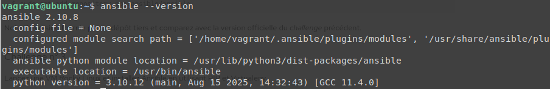

# ansible-kovacs
Pour le contrôle continu de Kiki


# TEST-01 :
```
cd formation-ansible/test-01/
vagrant up
```


### Les pings : 


------------------------------------------------------
# TEST-02 :
```
cd formation-ansible/test-02/
vagrant up
```


-------------------------------------------------------

# ATELIER-01 : 

## Challenge-01 :

* Démarrez la VM ubuntu depuis le répertoire atelier-01.
```
vagrant up ubuntu
```
* Connectez-vous à cette VM.
```
vagrant ssh ubuntu
```
* Rafraîchissez les informations sur les paquets.
```
sudo apt update
```
* Recherchez le paquet ansible avec les options qui vont bien.
```
apt-cache search --names-only ansible
```
* Installez le paquet officiel fourni par la distribution.
```
sudo apt install -y ansible
```
* Vérifiez si l'installation s'est bien déroulée.
```
ansible --version
```


`version : 2.10.8`

Déconnectez-vous et supprimez la VM.
```
exit

vagrant destroy -f ubuntu
```

## Challenge-02 :


-------------------------------------------------------

# ATELIER-02 : 

```


```

