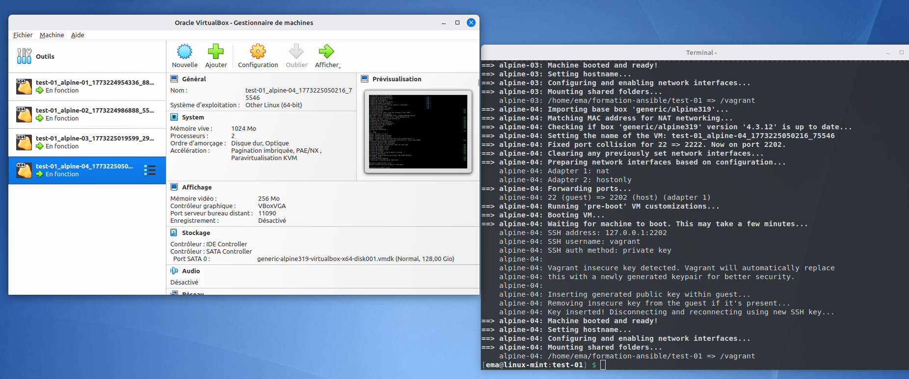
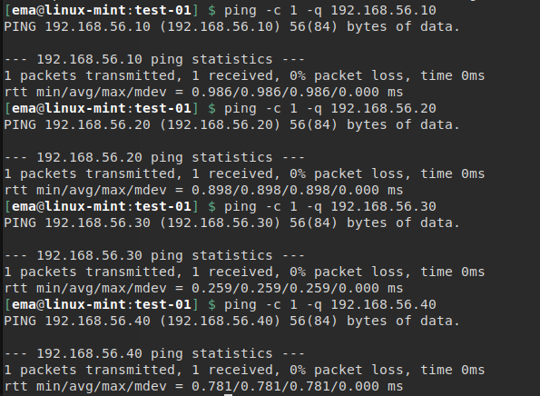
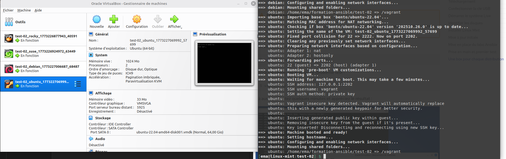

# ansible-kovacs
Pour le contrôle continu de Kiki


# TEST-01 :
```
cd formation-ansible/test-01/
vagrant up
```



### Les pings : 



------------------------------------------------------
# TEST-02 :
```
cd formation-ansible/test-02/
vagrant up
```



